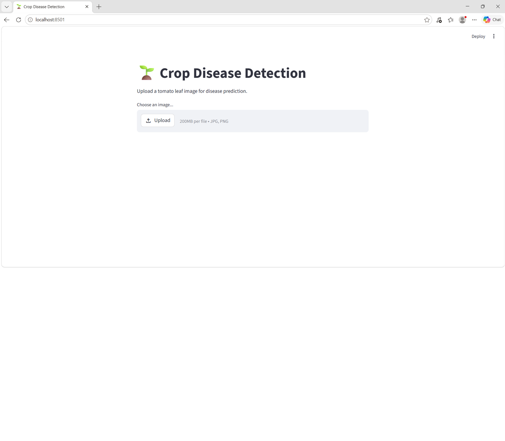
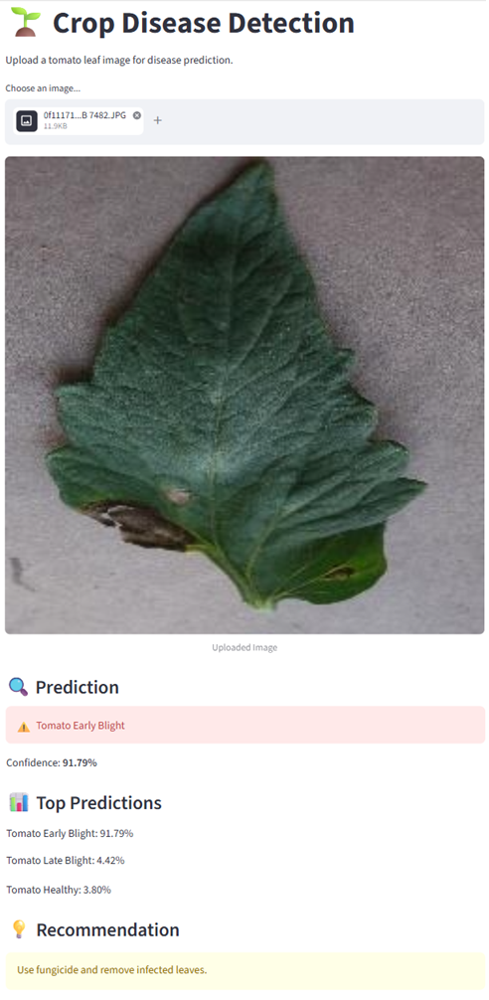
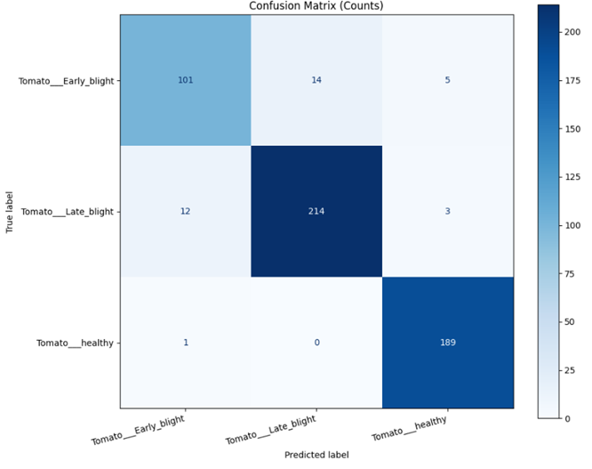

# 🌱 Crop Disease Detection using Deep Learning

An AI-powered Computer Vision system for detecting tomato leaf diseases using Deep Learning and Transfer Learning techniques. The project helps support precision agriculture by enabling early disease detection from plant leaf images.

---

# 📌 Problem Statement

Plant diseases significantly reduce agricultural productivity and food security worldwide. Manual inspection of crop health is time-consuming, error-prone, and often detects diseases too late.

This project uses Deep Learning and Computer Vision to automatically classify tomato leaf images into:
- Tomato Early Blight
- Tomato Late Blight
- Healthy Tomato Leaves

The goal is to provide fast and accurate disease diagnosis to support farmers and agronomists.

---

# 🚀 Features

✅ Custom CNN implementation from scratch  
✅ Transfer Learning using MobileNetV2  
✅ Image preprocessing and augmentation pipeline  
✅ Model evaluation using:
- Accuracy
- Precision
- Recall
- Confusion Matrix

✅ Real-time disease prediction system  
✅ Treatment recommendation engine  
✅ Streamlit web application for easy usage  
✅ Experiment tracking and result saving  

---

# 🛠️ Tech Stack

| Component | Technology |
|-----------|-------------|
| Programming Language | Python |
| Deep Learning | TensorFlow / Keras |
| Image Processing | OpenCV, PIL |
| Visualization | Matplotlib |
| Evaluation | Scikit-learn |
| Web App | Streamlit |

---

# 📂 Dataset

Dataset used:
- **PlantVillage Dataset** (Tomato leaf subset)

Classes used:
- Tomato___Early_blight
- Tomato___Late_blight
- Tomato___healthy

---

# 🧠 Model Architectures

## 1️⃣ Custom CNN
A Convolutional Neural Network built from scratch using:
- Conv2D
- MaxPooling
- Dense Layers
- Dropout

---

## 2️⃣ Transfer Learning (MobileNetV2)
Implemented Transfer Learning using:
- MobileNetV2 pretrained on ImageNet
- Fine-tuning of pretrained layers
- Low learning rate optimization

---

# 📊 Final Results

## Custom CNN
- Test Accuracy: **91.47%**

## MobileNetV2
- Test Accuracy: **94.06%**
- Test Precision: **95.27%**
- Test Recall: **93.32%**

---

# 🌐 Streamlit Application

The project includes a Streamlit web application for real-time tomato leaf disease prediction.

## Application Interface



---

## Example Prediction



---

# 📊 Confusion Matrix

The confusion matrix below shows the performance of the final MobileNetV2 model.



---

# 📈 Classification Report

| Class | Precision | Recall | F1-Score |
|------|-----------|--------|----------|
| Early Blight | 0.89 | 0.84 | 0.86 |
| Late Blight | 0.94 | 0.93 | 0.94 |
| Healthy | 0.96 | 0.99 | 0.98 |

---

# ⚖️ Tradeoff Analysis

The final MobileNetV2 model achieved strong overall performance while balancing precision and recall.

Fine-tuning and class weighting improved:
- Overall accuracy
- Prediction confidence
- Generalization performance

However, a slight reduction in Early Blight recall was observed due to the visual similarity between Early Blight and Late Blight symptoms.

Despite this tradeoff, the final model was retained because:
- Overall recall remained high
- Precision improved significantly
- Generalization on unseen data improved
- System-wide reliability increased

Future improvements may include:
- Additional Early Blight data
- Class-specific augmentation
- Ensemble learning techniques

---

# 🖼️ Sample Outputs

## Disease Prediction
```text
⚠️ Disease detected: Tomato Early Blight (96.7%)

💡 Recommendation:
Use fungicide and remove infected leaves.
```

---

# 📊 Confusion Matrix

The project includes:
- Raw confusion matrix
- Normalized confusion matrix
- Classification reports

for detailed model evaluation.

---

# 📁 Project Structure

```text
CropDiseaseDetection/
│
├── dataset/
├── tomato_dataset/
│
├── models/
├── results/
│
├── scripts/
│   ├── prepare_data.py
│   ├── load_data.py
│   ├── eda.py
│   ├── train_cnn.py
│   ├── train_mobilenet.py
│   ├── evaluate_model.py
│   └── predict.py
│
├── app/
│   └── streamlit_app.py
│
├── requirements.txt
├── README.md
└── .gitignore
```

---

# ▶️ Installation

## 1️⃣ Clone Repository

```bash
git clone <your-github-link>
cd CropDiseaseDetection
```

---

## 2️⃣ Install Dependencies

```bash
pip install -r requirements.txt
```

---

# 🏋️ Train Model

## Custom CNN

```bash
python scripts/train_cnn.py
```

## MobileNetV2

```bash
python scripts/train_mobilenet.py
```

---

# 📊 Evaluate Model

```bash
python scripts/evaluate_model.py
```

---

# 🔍 Run Prediction

```bash
python scripts/predict.py
```

---

# 🌐 Run Streamlit App

```bash
streamlit run app/streamlit_app.py
```

---

# 🌱 Streamlit Application Features

- Upload tomato leaf image
- Predict disease type
- View confidence scores
- Display top predictions
- Get treatment recommendations

---

# 📌 Key Learnings

Through this project:
- Built CNN models from scratch
- Applied Transfer Learning techniques
- Improved model generalization
- Performed real-world evaluation
- Developed deployment-ready inference systems
- Built an interactive AI web application

---

# 🔮 Future Improvements

- Support additional crop diseases
- Mobile deployment
- Real-time camera integration
- Cloud deployment
- Ensemble deep learning models
